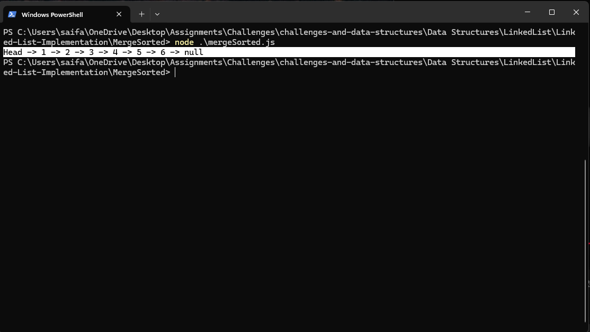
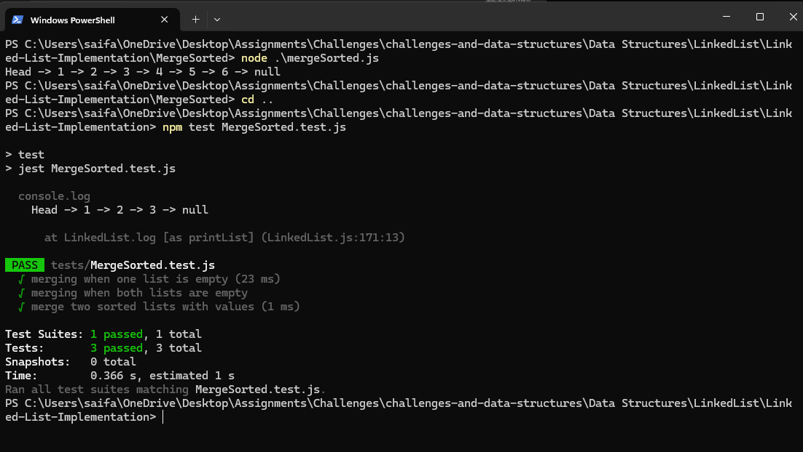

# Singly Linked List + Merge Sorted Lists

> A minimal singly linked list in JavaScript with `add`, `remove`, `includes`, `insertAt`, `reverse`, `printList`, **and** a static `mergeSortedLists(list1, list2)` method. Includes Jest tests.

[⬅ Back to Root README](../../../../README.md)

---

## 🧩 Problem Domain

Build a simple **singly linked list** that stores numbers.  
Support core operations **without using array methods** to manage nodes:

- `add(data)`: append a new node to the end of the list
- `remove(data)`: remove the **first** node whose value matches `data`
- `includes(data)`: return `true` if `data` exists in the list
- `insertAt(data, index)`: insert a new node at a specific zero-based index
- `reverse()`: reverse the list in-place
- `printList()`: print a readable representation (`Head -> 5 -> 10 -> null`)

**New challenge:**  
Add `LinkedList.mergeSortedLists(list1, list2)` to **merge two sorted linked lists** into a **new sorted linked list** (non-destructive).

---

## 🔢 Inputs and Expected Outputs (Examples)

```text
List 1: Head -> 1 -> 3 -> 5 -> null
List 2: Head -> 2 -> 4 -> 6 -> null
Merged: Head -> 1 -> 2 -> 3 -> 4 -> 5 -> 6 -> null
```

```text
List 1: Head -> 5 -> 10 -> 15 -> null
List 2: Head -> 2 -> 3  -> 20 -> null
Merged: Head -> 2 -> 3 -> 5 -> 10 -> 15 -> 20 -> null
```

```text
List 1: Head -> 10 -> 20 -> 30 -> null
List 2: Head -> 5  -> 15 -> 25 -> 35 -> null
Merged: Head -> 5 -> 10 -> 15 -> 20 -> 25 -> 30 -> 35 -> null
```

---

## ⚠️ Edge Cases

- **One list is empty** → return a copy of the non-empty list.
- **Both lists are empty** → return an **empty list** (`head = null`).
- **Duplicates** → keep **all** duplicates in the merged result.
- Works if either list has **one node**.
- Handles already-ordered or identical lists.

---

## 👀 Visual (Merge Sorted Lists)

After Adding Lsit1: 1, 3, 5

```text
Head -> [1] -> [3] -> [5] -> null
```

After Adding List2: 2, 4, 6

```text
Head -> [2] -> [4] -> [6] -> null
```

After Mering Them: 1, 2, 3, 4, 5, 6

```text
Head -> [1] -> [2] -> [3] -> [4] -> [5] -> [6] -> null
```

---

## ⚙️ Algorithms (Descriptions)

- **mergeSortedLists(list1, list2)** (static, non-destructive)  
  Two-pointer walk (`curr1`, `curr2`) comparing values; append smaller to new list; append remaining tail when one list ends. Uses a dummy node to simplify tail handling.  
  **Time:** O(n + m) · **Space:** O(n + m)

---

## 💻 Files

> Full implementation is available in this folder:  
> [`nod.js`](../nod.js) · [`LinkedList.js`](../LinkedList.js) · [`mergeSorted.js`](./mergeSorted.js)  
> Tests: [`tests/LinkedList.test.js`](../tests/LinkedList.test.js) · [`tests/MergeSorted.test.js`](../tests/MergeSorted.test.js)

---

## 🧮 Big-O Summary

| Operation                        | Time         | Space  |
| -------------------------------- | ------------ | ------ |
| `add(data)`                      | **O(n)**     | O(1)   |
| `remove(data)`                   | **O(n)**     | O(1)   |
| `includes(data)`                 | **O(n)**     | O(1)   |
| `insertAt(data, index)`          | **O(n)**     | O(1)   |
| `reverse()`                      | **O(n)**     | O(1)   |
| `printList()`                    | **O(n)**     | O(1)   |
| `mergeSortedLists(list1, list2)` | **O(n + m)** | O(n+m) |

---

## ▶️ How to Run

### 1) Navigate to this folder

```bash
cd "Data Structures/LinkedList/Linked-List-Implementation/MergeSorted"
```

### 2) Run the demo

```bash
node mergesorted.js
```

🖥️ Example Output:


### 3) Run tests (Jest)

```bash
npm test
```

✅ Test Results:


You can run a single suite:

```bash
npm test LinkedList.test.js
npm test MergeSorted.test.js
```

---

## ✅ Notes

- `mergeSortedLists` **does not mutate** the input lists; it returns a new list.
