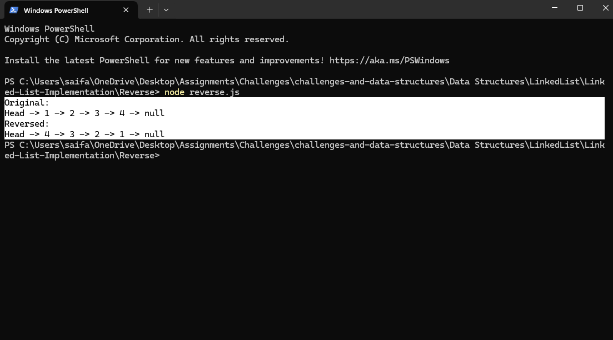
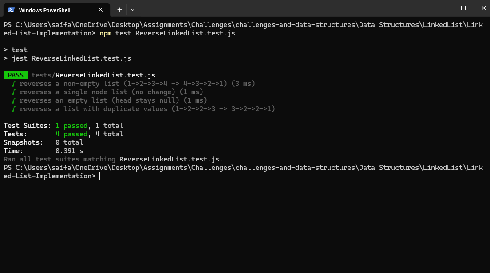

# Reverse a Singly Linked List

This mini‑project implements and tests an **in‑place reverse** of a singly linked list in JavaScript. It includes a working method, usage example, and Jest tests.

[⬅ Back to Root README](../../../../README.md)

---

## 🧩 Problem Domain

Given the head of a singly linked list, **reverse the list in-place** so that the last node becomes the head and all `next` pointers are flipped. Return the modified list (to allow method chaining).

---

## 🔢 Inputs and ✅ Expected Outputs

| Input list (head → …)  | After `reverse()` (head → …) |
| ---------------------- | ---------------------------- |
| `1 → 2 → 3 → 4 → null` | `4 → 3 → 2 → 1 → null`       |
| `10 → null`            | `10 → null`                  |
| `∅ (head = null)`      | `∅ (head = null)`            |
| `1 → 2 → 2 → 3 → null` | `3 → 2 → 2 → 1 → null`       |

**Console :**

```js
const LinkedList = require("../LinkedList");

const list = new LinkedList();
list.add(1).add(2).add(3).add(4);

console.log("Original:");
list.printList(); // 1 -> 2 -> 3 -> 4

list.reverse();
console.log("Reversed:");
list.printList(); // 4 -> 3 -> 2 -> 1
```

---

## ⚠️ Edge Cases

- **Empty list** (`head === null`) → no change.
- **Single node** (`head.next === null`) → no change.
- **Duplicate values** (e.g., `1 → 2 → 2 → 3`) → order still reverses correctly.
- **Method chaining** is preserved by returning `this`.

---

## 👀 Visual

After Adding: 1, 2, 3, 4

```js
 Head -> [1] -> [2] -> [3] -> [4] -> Null
```

After reversing : 4, 3, 2, 1

```js
Head -> [4] -> [3] -> [2] -> [1] -> Null
```

---

## 🧠 Algorithm

Use three pointers and iterate once:

1. `prev = null`
2. `curr = head`
3. While `curr`:
   - `next = curr.next`
   - `curr.next = prev`
   - `prev = curr`
   - `curr = next`
4. `head = prev`
5. Return `this` to allow chaining

---

## 💻 Real Code (method on LinkedList)

> Full implementation is available in this folder:  
> [`nod.js`](../nod.js) | [`LinkedList.js`](../LinkedList.js) | [`reverse.js`](./reverse.js) | [`ReversedLinkedList.test.js`](../tests/ReverseLinkedList.test.js)

---

## ⏱️ Big‑O Time/Space Complexity

- **Time:** `O(n)` — each node is visited exactly once.
- **Space:** `O(1)` — reversal is done in place using a few pointers.

---

## ▶️ How to Run

### 📂 Step 1 — Navigate to the reverse folder

```bash
cd "Data Structures/LinkedList/Linked-List-Implementation/reverse"
```

▶️ Step 2 — Run the demo

```bash
node reverse.js
```

🖥️ Example Output:


🧪 Step 3 — Run the tests (requires Jest)

```bash
npm test
```

✅ Test Results:

