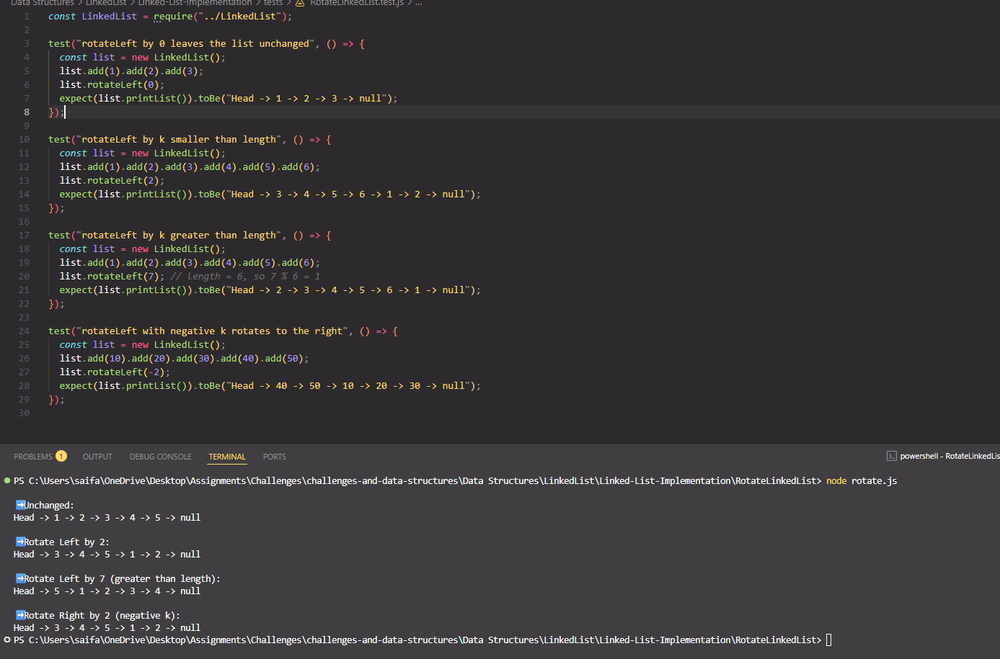
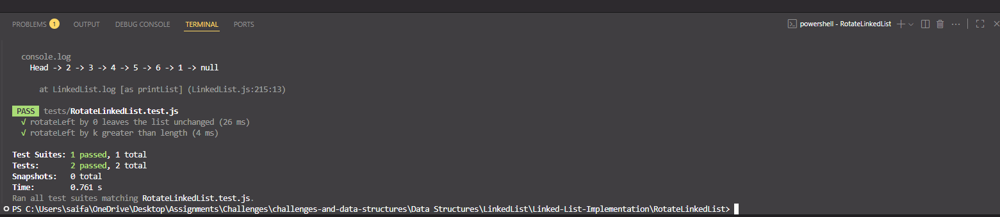

# Singly Linked List + **Rotate Left (k)**

> A minimal singly linked list in JavaScript extended with a `rotateLeft(k)` method in addition to `add`, `remove`, `includes`, `insertAt`, `reverse`, `printList`, and `mergeSortedLists`. Includes Jest tests.

[⬅ Back to Root README](../../../../README.md)

---

## 🧩 Problem Domain

Given a **singly linked list** and an integer **`k`**, rotate the list **to the left by `k` places**.

- After rotating, the node which was **originally at position `k`** will become the **new head**, and the remaining nodes will follow in the same order.
- The operation should be **in-place** (relink nodes by changing `next` pointers).

---

## 🔢 Inputs and Expected Outputs (Examples)

```text
Input:  Head -> 1 -> 2 -> 3 -> 4 -> 5 -> 6 -> null,  k = 2
Output: Head -> 3 -> 4 -> 5 -> 6 -> 1 -> 2 -> null
```

```text
Input:  Head -> 10 -> 20 -> 30 -> 40 -> 50 -> null, k = 3
Output: Head -> 40 -> 50 -> 10 -> 20 -> 30 -> null
```

```text
Input:  Head -> 5 -> 10 -> 15 -> 20 -> null, k = 1
Output: Head -> 10 -> 15 -> 20 -> 5 -> null
```

```text
Input:  Head -> 1 -> 2 -> 3 -> null, k = 7  (k > length)
Output: Head -> 2 -> 3 -> 1 -> null        (since 7 % 3 = 1)
```

```text
Input:  Head -> 10 -> 20 -> 30 -> 40 -> null, k = -2 (negative)
Output: Head -> 30 -> 40 -> 10 -> 20 -> null        (rotate right by 2)
```

---

## ⚠️ Edge Cases

- **Empty list** or **single node** → list remains unchanged.
- **k = 0** → list remains unchanged.
- **k < 0** → rotate **right** by `abs(k)` (equivalent to left by `length - (abs(k) % length)`).
- **k > length** → normalize via `k = k % length`.
- Works correctly with **duplicate values**.

---

## 👀 Visual (Rotate Left)

Original list:

```text
Head -> [1] -> [2] -> [3] -> [4] -> [5] -> [6] -> null
```

Rotate left by **2** (k = 2):

```text
Tail connects to Head to form a circle,
newHead is the (k+1)th node, and break after kth node.

Result:
Head -> [3] -> [4] -> [5] -> [6] -> [1] -> [2] -> null
```

---

## ⚙️ Algorithm (Description)

1. **Handle trivial cases**: if the list is empty, has one node, or `k === 0` → return as is.
2. **Normalize `k`**:
   - `k = k % length`
   - If `k < 0`, convert to an equivalent left rotation: `k = (length + k) % length`
   - If `k === 0` after normalization → return as is.
3. **Walk to the `k`th node** (1‑based) and keep a pointer to it (`kth`).
4. **Walk to the tail** and connect `tail.next = head` to form a circle.
5. **New head** is `kth.next`; **break** the circle: `kth.next = null`.
6. Return the list.

**Time:** O(n) · **Space:** O(1)

---

## 💻 Files

> Full implementation for this challenge lives in this folder:  
> [`nod.js`](../nod.js) · [`LinkedList.js`](../LinkedList.js) · [`RotateLinkedList/rotate.js`](./rotate.js)  
> Tests: [`tests/rotateLinkedList.test.js`](../tests/rotateLinkedList.test.js)

---

## 🧮 Big‑O Summary

| Operation          | Time     | Space |
| ------------------ | -------- | ----- |
| `rotateLeft(k)`    | **O(n)** | O(1)  |
| (others unchanged) |          |       |

---

## ▶️ How to Run

### 1) Navigate to this folder

```bash
cd "Data Structures/LinkedList/Linked-List-Implementation/RotateLinkedList"
```

### 2) Run the demo

```bash
node rotate.js
```

🖥️ Example Output:


🧪 Step 3 — Run the tests (requires Jest)

### 3) Run tests (Jest)

```bash
npm test
```

Or a single suite:

```bash
npm test rotateLinkedList.test.js
```

✅ Test Results:

