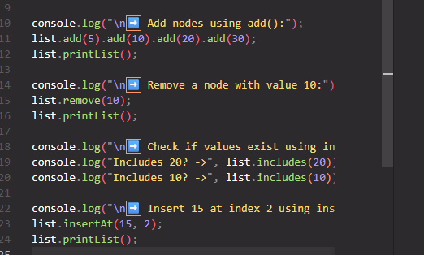
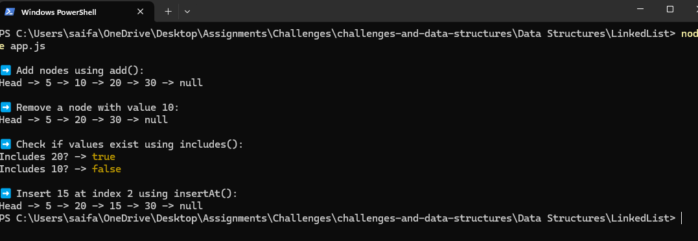
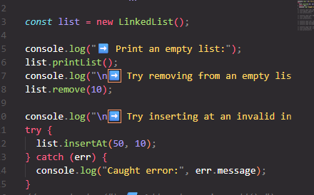
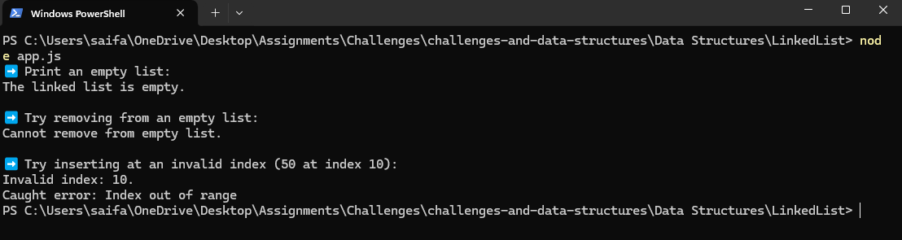
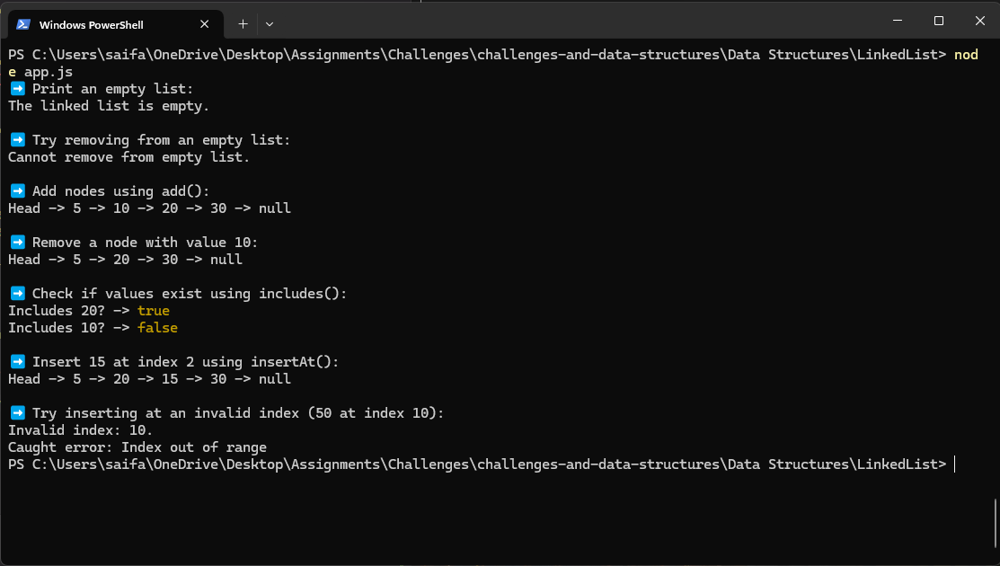
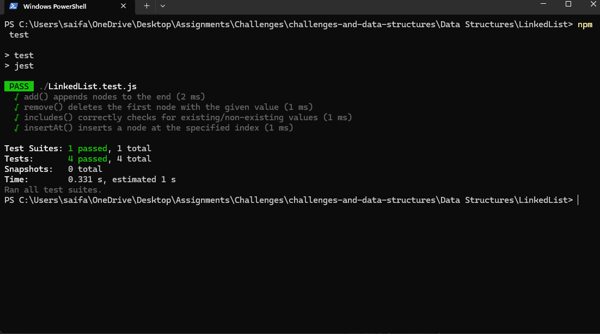

# Singly Linked List

> A minimal singly linked list implementation in JavaScript with `add`, `remove`, `includes`, `insertAt`, and `printList`, plus Jest tests.

[⬅ Back to Root README](../../README.md)

---

## 📑 Table of Contents

- [🧩 Problem Domain](#-problem-domain)
- [🔢 Inputs & Outputs](#-inputs-and-expected-outputs)
- [⚠️ Edge Cases](#️-edge-cases)
- [👀 Visual](#-visual)
- [⚙️ Algorithm](#️-algorithm-high-level)
- [💻 Real Code](#-real-code)
- [🧮 Big-O Complexity](#-big-o-time--space-complexity)
- [▶️ How to Run](#️-how-to-run)

---

## 🧩 Problem Domain

Build a simple **singly linked list** that stores numbers.  
Support these operations **without using array methods** to manage nodes:

- `add(data)`: append a new node to the end of the list
- `remove(data)`: remove the **first** node whose value matches `data`
- `includes(data)`: return `true` if `data` exists in the list
- `insertAt(data, index)`: insert a new node at a specific zero-based index
- `printList()`: print a readable representation (`Head -> 5 -> 10 -> null`)

---

## 🔢 Inputs and Expected Outputs

### 🟦 Input



### 🟩 Output



---

## ⚠️ Edge Cases

### 🟦 Input



### 🟥 Output



---

---

## 👀 Visual

After Adding: 5, 10, 20, 30

```js
 Head -> [5] -> [10] -> [20] -> [30] -> Null
```

After Remove: 10

```js
Head -> [5] -> [20] -> [30] -> Null
```

After Insert at index 2: 15

```js
Head -> [5] -> [10] -> [15] -> [20] -> [30] -> Null
```

---

## ⚙️ Algorithm (Descriptions)

- **add(data)**

  - Create a new `Node(data)`.
  - If `head` is `null`, set it as `head`.
  - Else traverse to the tail and append.
  - **Time: O(n)** | **Space: O(1)**

- **remove(data)**

  - If empty → return `false`.
  - If `head.data === data`, move `head`.
  - Else traverse with `prev/curr`, bypass node if found.
  - **Time: O(n)** | **Space: O(1)**

- **includes(data)**

  - Traverse list and compare values.
  - **Time: O(n)** | **Space: O(1)**

- **insertAt(data, index)**

  - Validate `0 ≤ index ≤ length`, else throw.
  - If `index === 0`, insert at head.
  - Else walk to `index - 1`, splice node.
  - **Time: O(n)** | **Space: O(1)**

- **printList()**
  - Traverse and print nodes.
  - **Time: O(n)** | **Space: O(1)**

---

## 💻 Real Code

> Full implementation is available in this folder:  
> [`nod.js`](./nod.js) | [`LinkedList.js`](./LinkedList.js) | [`app.js`](./app.js) | [`LinkedList.test.js`](./LinkedList.test.js)

---

## 🧮 Big-O Time / Space Complexity

| Operation               | Time                         | Space    |
| ----------------------- | ---------------------------- | -------- |
| `add(data)`             | **O(n)** (walk to tail)      | **O(1)** |
| `remove(data)`          | **O(n)**                     | **O(1)** |
| `includes(data)`        | **O(n)**                     | **O(1)** |
| `insertAt(data, index)` | **O(n)** (walk to `index-1`) | **O(1)** |
| `printList()`           | **O(n)**                     | **O(1)** |

---

## ▶️ How to Run

### 📂 Step 1 — Navigate to the LinkedList folder

```bash
cd "Data Structures/LinkedList"
```

▶️ Step 2 — Run the demo

```bash
node app.js
```

🖥️ Example Output:


🧪 Step 3 — Run the tests (requires Jest)

```bash
npm test
```

✅ Test Results:

