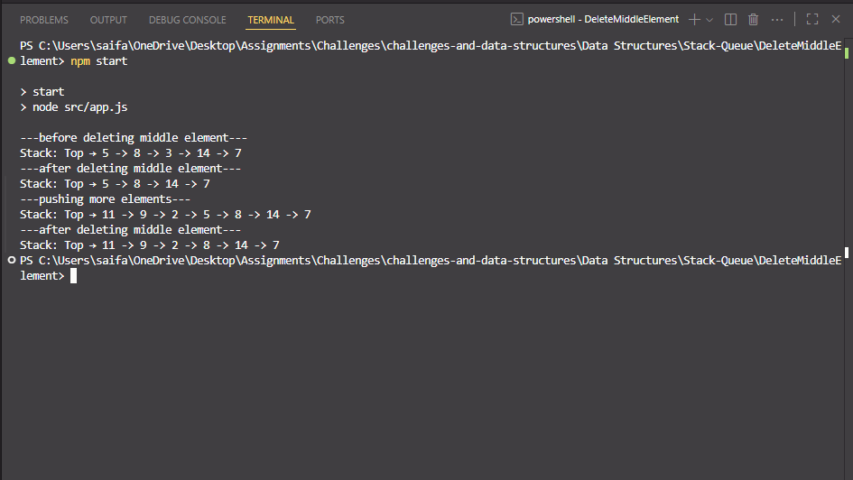
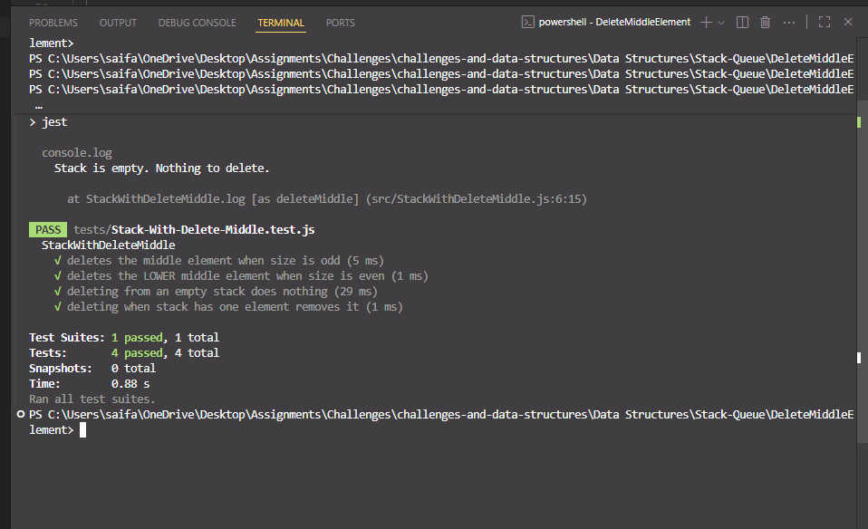

# Delete Middle Element in Stack

> An implementation of a **Stack with deleteMiddle()** in JavaScript using a singly linked `Node`. Includes Jest tests.

[⬅ Back to Root README](../../../README.md)

---

## 🧩 Problem Domain

Implement a **Stack (Last-In, First-Out)** using linked nodes with the following operations:

- `push(value)` – add a value to the top
- `pop()` – remove and return the top value (or `null` if empty)
- `peek()` – return the top value without removing (or `null` if empty)
- `isEmpty()` – return `true` if the stack is empty, else `false`
- `deleteMiddle()` – delete the middle element of the stack
  - If size is odd → remove exact middle
  - If size is even → remove the **lower middle** element

---

## 🔢 Inputs and Expected Outputs (Examples)

```text
Input:  push(7), push(14), push(3), push(8), push(5)
Output: Top -> [5] -> [8] -> [3] -> [14] -> [7] -> null
```

```text
Input:  deleteMiddle()
Output: Top -> [5] -> [8] -> [14] -> [7] -> null   (removed 3)
```

```text
Input:  push(2), push(9), push(11)
Output: Top -> [11] -> [9] -> [2] -> [5] -> [8] -> [14] -> [7] -> null
```

```text
Input:  deleteMiddle()
Output: Top -> [11] -> [9] -> [2] -> [8] -> [14] -> [7] -> null   (removed 5)
```

---

## ⚠️ Edge Cases

- **Empty stack** → `deleteMiddle()` does nothing.
- **One element** → `deleteMiddle()` removes the only element.

---

## 👀 Visual

### Stack with deleteMiddle()

```text
Initial: Empty

push(7)   → Top -> [7] -> null
push(14)  → Top -> [14] -> [7] -> null
push(3)   → Top -> [3]  -> [14] -> [7] -> null
push(8)   → Top -> [8]  -> [3]  -> [14] -> [7] -> null
push(5)   → Top -> [5]  -> [8]  -> [3]  -> [14] -> [7] -> null

deleteMiddle() → removes [3]
                 Top -> [5] -> [8] -> [14] -> [7] -> null

push(2)   → Top -> [2]  -> [5]  -> [8] -> [14] -> [7] -> null
push(9)   → Top -> [9]  -> [2]  -> [5] -> [8]  -> [14] -> [7] -> null
push(11)  → Top -> [11] -> [9]  -> [2] -> [5]  -> [8]  -> [14] -> [7] -> null

deleteMiddle() → removes [5]
                 Top -> [11] -> [9] -> [2] -> [8] -> [14] -> [7] -> null
```

---

## ⚙️ Algorithm (Description)

- **push(value)**

  - Create a new node.
  - Point new node’s `next` to current `top`.
  - Update `top` and size.
  - **Time:** O(1) · **Space:** O(1)

- **pop()**

  - If empty → return `null`.
  - Save `top.value`; move `top = top.next` and decrement size.
  - **Time:** O(1) · **Space:** O(1)

- **peek()**

  - Return `top?.value ?? null`.
  - **Time:** O(1)

- **isEmpty()**

  - Return `length === 0`.

- **deleteMiddle()**
  - Find middle index (odd → `n/2`, even → `n/2 - 1`).
  - Use an auxiliary structure (array or temp stack) to remove the middle element.
  - Rebuild stack in correct order.
  - **Time:** O(n) · **Space:** O(n)

---

## 💻 Files

> Full implementation for this challenge lives in this folder:  
> [`src/stack.js`](../Stack-Queue-Implementation/src/Stack.js) · [`src/stackWithDeleteMiddle.js`](./src/stackWithDeleteMiddle.js)  
> Tests: [`tests/stackWithDeleteMiddle.test.js`](./tests/Stack-With-Delete-Middle.test.js)

---

## 🧮 Big‑O Summary

| Operation    | Time | Space |
| ------------ | ---- | ----- |
| push         | O(1) | O(1)  |
| pop          | O(1) | O(1)  |
| peek         | O(1) | O(1)  |
| isEmpty      | O(1) | O(1)  |
| deleteMiddle | O(n) | O(n)  |

---

## ▶️ How to Run

### 1) Navigate to this folder

```bash
cd "Data Structures/Stack-Queue/DeleteMiddleStack"
```

### 2) Run the demo

```bash
node src/app.js
```

🖥️ Example Output:


### 3) Run tests (Jest)

```bash
npm install
npm test
```

Or run just this test file:

```bash
npm test stackWithDeleteMiddle.test.js
```

✅ Test Results:


