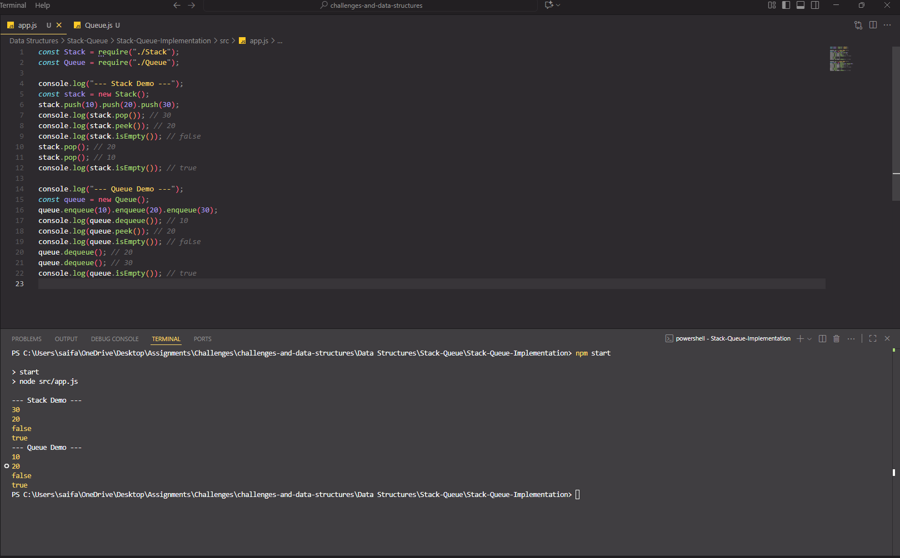
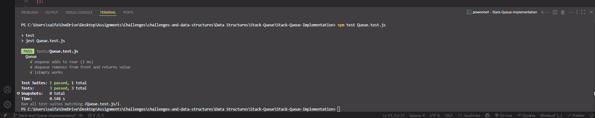
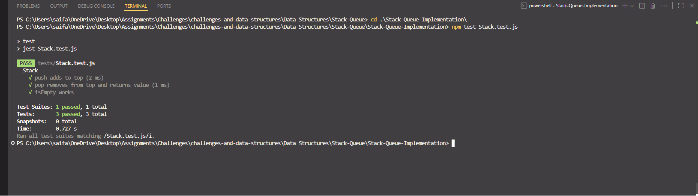

# Stack & Queue Implementation

> A minimal implementation of **Stack (LIFO)** and **Queue (FIFO)** in JavaScript using a singly linked `Node`. Includes Jest tests.

[⬅ Back to Root README](../../../README.md)

---

## 🧩 Problem Domain

Implement two fundamental data structures using linked nodes:

- **Stack (Last-In, First-Out)**  
  Supports: `push`, `pop`, `peek`, `isEmpty`

- **Queue (First-In, First-Out)**  
  Supports: `enqueue`, `dequeue`, `peek`, `isEmpty`

Constraints:

- Do **not** use JavaScript array methods like `push` or `shift` internally.
- Must use your own `Node` class with `value` and `next` pointers.

---

## 🔢 Inputs and Expected Outputs (Examples)

### Stack

```text
Input:  push(10), push(20), push(30)
Output: Top -> [30] -> [20] -> [10] -> null
```

```text
Input:  pop()
Output: 30,  Top -> [20] -> [10] -> null
```

```text
Input:  peek()
Output: 20
```

---

### Queue

```text
Input:  enqueue(10), enqueue(20), enqueue(30)
Output: Front -> [10] -> [20] -> [30] -> null (Rear)
```

```text
Input:  dequeue()
Output: 10,  Front -> [20] -> [30] -> null (Rear)
```

```text
Input:  peek()
Output: 20
```

---

## ⚠️ Edge Cases

- **Empty structure** → `pop()` or `dequeue()` should return `null`.
- **peek() on empty** → returns `null`.

---

## 👀 Visual

### Stack (push & pop)

```text
Initial:  Empty

push(10) → Top -> [10] -> null
push(20) → Top -> [20] -> [10] -> null
push(30) → Top -> [30] -> [20] -> [10] -> null

pop()    → returns 30
           Top -> [20] -> [10] -> null
```

### Queue (enqueue & dequeue)

```text
Initial:  Empty

enqueue(10) → Front -> [10] -> null (Rear)
enqueue(20) → Front -> [10] -> [20] -> null (Rear)
enqueue(30) → Front -> [10] -> [20] -> [30] -> null (Rear)

dequeue()   → returns 10
              Front -> [20] -> [30] -> null (Rear)
```

---

## ⚙️ Algorithm (Description)

### Stack

- **push(value)**

  - Create new node.
  - Point new node’s `next` to current `top`.
  - Update `top`.
  - **Time:** O(1) · **Space:** O(1)

- **pop()**

  - If empty → return `null`.
  - Save `top.value`.
  - Move `top = top.next`.
  - **Time:** O(1) · **Space:** O(1)

- **peek()**

  - Return `top?.value ?? null`.
  - **Time:** O(1)

- **isEmpty()**
  - Return `length === 0`.

---

### Queue

- **enqueue(value)**

  - Create new node.
  - If empty → set `front = rear = node`.
  - Else attach to `rear.next` and move `rear = node`.
  - **Time:** O(1)

- **dequeue()**

  - If empty → return `null`.
  - Save `front.value`.
  - Move `front = front.next`.
  - If empty after → `rear = null`.
  - **Time:** O(1)

- **peek()**

  - Return `front?.value ?? null`.

- **isEmpty()**
  - Return `length === 0`.

---

## 💻 Files

> Full implementation for this challenge lives in this folder:  
> [`src/Node.js`](./src/Node.js) · [`src/Stack.js`](./src/Stack.js) · [`src/Queue.js`](./src/Queue.js) · [`src/app.js`](./src/app.js)  
> Tests: [`tests/Stack.test.js`](./tests/Stack.test.js) · [`tests/Queue.test.js`](./tests/Queue.test.js)

---

## 🧮 Big‑O Summary

| Operation | Stack | Queue |
| --------- | ----- | ----- |
| Insert    | O(1)  | O(1)  |
| Remove    | O(1)  | O(1)  |
| Peek      | O(1)  | O(1)  |
| isEmpty   | O(1)  | O(1)  |

---

## ▶️ How to Run

### 1) Navigate to this folder

```bash
cd "Data Structures/Stack-Queue/Stack-Queue-Implementation"
```

### 2) Run the demo

```bash
node src/app.js
```

🖥️ Example Output:


### 3) Run tests (Jest)

```bash
npm install
npm test
```

Or run one test file:

```bash
npm test stack.test.js
npm test queue.test.js
```

✅ Test Results:

### Queue test



---

### Stack test


