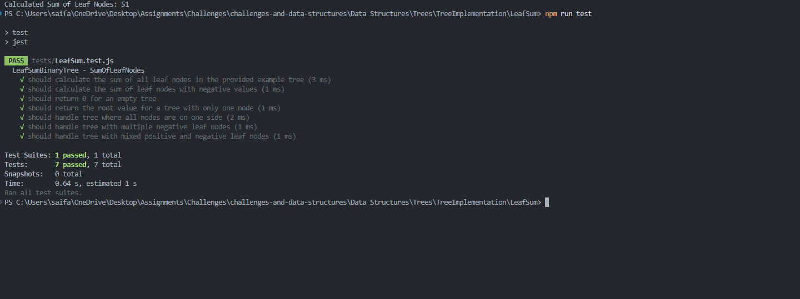

# 🌳 Sum of Leaf Nodes in a Binary Tree

> An implementation to find the **sum of all leaf nodes** in a binary tree in JavaScript using recursion and a `TNode` class. Includes Jest tests.

[⬅ Back to Root README](../../../../README.md)

---

## 🧩 Problem Domain

Extend the binary tree implementation to calculate the sum of all leaf nodes in the tree. A **leaf node** is defined as a node that does not have any children (both left and right children are `null`).

### **LeafSumBinaryTree**

A class that extends **BinaryTree** and adds:

- `SumOfLeafNodes()` – calculates and returns the sum of all leaf nodes in the tree.

All methods handle errors gracefully with `try...catch`.

---

## 🔢 Inputs and Expected Outputs (Examples)

For this tree:

```text
        9
       / \
      8   12
     / \  / \
    3  7 17 23
     \
      4
```

| Function         | Expected Output | Explanation              |
| ---------------- | --------------- | ------------------------ |
| SumOfLeafNodes() | 51              | Leaf nodes: 4, 7, 17, 23 |

**Calculation:** 4 + 7 + 17 + 23 = **51**

---

## ⚠️ Edge Cases

- **Empty tree** → returns `0`
- **Single node tree** → returns the value of that node (as it's a leaf)
- **Tree with negative values** → correctly sums negative leaf values
- **Tree with all nodes on one side** → correctly identifies the single leaf node

---

## 👀 Visual Representation

```text
Initial Tree:
        9
       / \
      8   12
     / \  / \
    3  7 17 23
     \
      4

Leaf Nodes Identified: 4, 7, 17, 23
Sum = 4 + 7 + 17 + 23 = 51
```

---

## ⚙️ Algorithm Overview

1. **Base Case**: If the tree is empty, return `0`.
2. **Traverse the Tree**: Use recursive traversal to visit each node.
3. **Identify Leaf Nodes**: Check if a node has no left and no right children.
4. **Sum Calculation**: Add the value of each leaf node to a running sum.
5. **Return Result**: After traversal completes, return the total sum.

### **Pseudocode:**

```text
FUNCTION SumOfLeafNodes(node, sum):
    IF node is NULL:
        RETURN

    IF node.left is NULL AND node.right is NULL:
        sum = sum + node.data

    SumOfLeafNodes(node.left, sum)
    SumOfLeafNodes(node.right, sum)

    RETURN sum
```

---

## 💻 Files

> Full implementation for this challenge lives in this folder:  
> [`src/TNode.js`](../src/TNode.js) · [`src/LeafSum.js`](./src/LeafSum.js) · [`src/app.js`](./src/app.js)  
> Tests: [`tests/LeafSum.test.js`](./tests/LeafSum.test.js)

---

## 🧮 Big‑O Summary

| Operation        | Time (avg) | Time (worst) | Space |
| ---------------- | ---------- | ------------ | ----- |
| SumOfLeafNodes() | O(n)       | O(n)         | O(h)  |

- **Time Complexity**: O(n) - where `n` is the number of nodes in the tree. We visit each node exactly once.
- **Space Complexity**: O(h) - where `h` is the height of the tree, representing the maximum depth of the recursive call stack.

---

## ▶️ How to Run

### 1) Navigate to this folder

```bash
cd "Data Structures/Trees/TreeImplementation/LeafSum"
```

### 2) Install dependencies

```bash
npm install
```

### 3) Run the demo

```bash
npm start
```

### 4) Run the tests

```bash
npm test
```

---

## 📸 Console Output Example

## 

---

## 🧪 Test Cases


