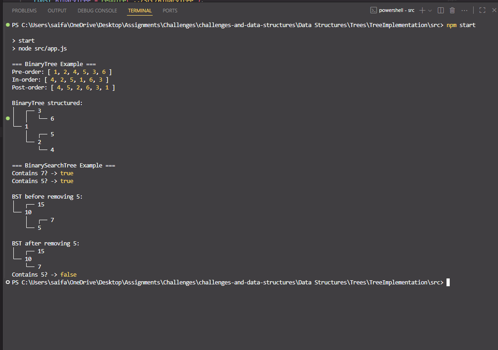
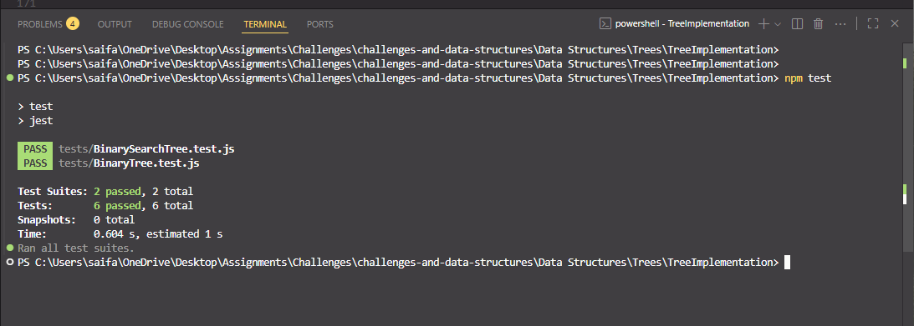

# 🌳 Binary Tree & Binary Search Tree Implementation

> A minimal implementation of **Binary Tree** and **Binary Search Tree (BST)** data structures in JavaScript using recursion and a `TNode` class for tree nodes. Includes Jest tests.

[⬅ Back to Root README](../../../README.md)

---

## 🧩 Problem Domain

Implement the following tree structures:

### **BinaryTree**

A generic tree structure supporting:

- `preOrder()` – traverse **Root → Left → Right**
- `inOrder()` – traverse **Left → Root → Right**
- `postOrder()` – traverse **Left → Right → Root**
- `print()` – display the tree in a structured way

### **BinarySearchTree (BST)**

A special type of binary tree maintaining sorted order:

- `add(value)` – insert a node in the correct position
- `contains(value)` – check if the value exists in the tree
- `remove(value)` – delete a node while keeping BST properties

All methods handle errors gracefully with `try...catch`.

---

## 🔢 Inputs and Expected Outputs (Examples)

### BinaryTree Traversals

For this tree:

```text
        1
       / \
      2   3
     / \
    4   5
```

| Traversal Type | Expected Output |
| -------------- | --------------- |
| Pre-Order      | [1, 2, 4, 5, 3] |
| In-Order       | [4, 2, 5, 1, 3] |
| Post-Order     | [4, 5, 2, 3, 1] |

---

### BinarySearchTree Example

```js
const bst = new BinarySearchTree();

bst.add(10);
bst.add(5);
bst.add(15);
bst.add(7);

console.log(bst.contains(7)); // true
bst.remove(5);
console.log(bst.contains(5)); // false
```

---

## ⚠️ Edge Cases

- Adding duplicate values → ignored or safely handled
- Searching/removing in an empty tree → returns `false` or `null`
- Removing non-existent values → does nothing
- Traversing an empty tree → returns `[]`

---

## 👀 Visual Representation

### BinarySearchTree Example

```text
Initial:  Empty

add(10) →       10
add(5)  →      /  \
              5    null
add(15) →     / \   \
             5  null  15
add(7)  →    / \     \
            5   7      15
```

After removing 5:

```text
       10
      /  \
     7    15
```

---

## ⚙️ Algorithm Overview

### BinaryTree Traversals

Each traversal uses **recursion**:

- **PreOrder:** visit root, then left, then right.
- **InOrder:** visit left, then root, then right.
- **PostOrder:** visit left, then right, then root.

### BinarySearchTree

- **add(value)** → recursively find correct spot and insert.
- **contains(value)** → recursively search for the value.
- **remove(value)** → recursively delete node while maintaining tree balance.

---

## 💻 Files

> Full implementation for this challenge lives in this folder:  
> [`src/TNode.js`](./src/TNode.js) · [`src/App.js`](./src/App.js) · [`src/BinaryTree.js`](./src/BinaryTree.js) · [`src/BinarySearchTree.js`](./src/BinarySearchTree.js)  
> Tests: [`tests/BinaryTree.test.js`](./tests/BinaryTree.test.js) · [`tests/BinarySearchTree.test.js`](./tests/BinarySearchTree.test.js)

---

## 🧮 Big‑O Summary

| Operation                  | Time (avg) | Time (worst) | Space |
| -------------------------- | ---------- | ------------ | ----- |
| preOrder/inOrder/postOrder | O(n)       | O(n)         | O(n)  |
| add                        | O(log n)   | O(n)         | O(1)  |
| contains                   | O(log n)   | O(n)         | O(1)  |
| remove                     | O(log n)   | O(n)         | O(1)  |

---

## ▶️ How to Run

### 1) Navigate to this folder

```bash
cd "Data Structures/Trees/TreeImplementation"
```

### 2) Run the demo

```bash
node src/app.js
```

🖥️ Example Output:

```text
PreOrder: [1, 2, 4, 5, 3]
InOrder:  [4, 2, 5, 1, 3]
PostOrder:[4, 5, 2, 3, 1]
BST Contains 7? → true
BST Contains 5? → false
```

🖥️ Example Output:


### 3) Run tests (Jest)

```bash
npm install
npm test
```

Or run just this test file:

```bash
npm test binaryTree.test.js
```

✅ Test Results:
All traversal and BST operations pass.

🖥️ Example Output:

