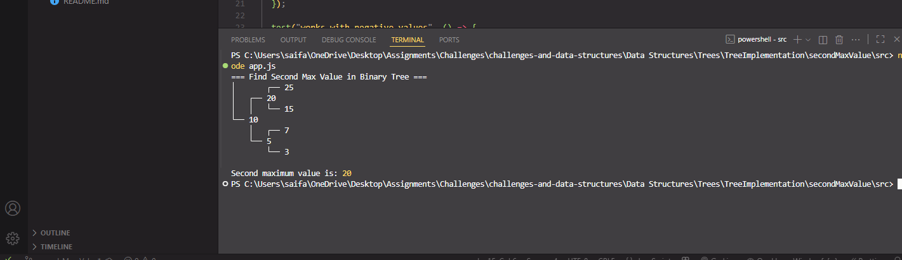
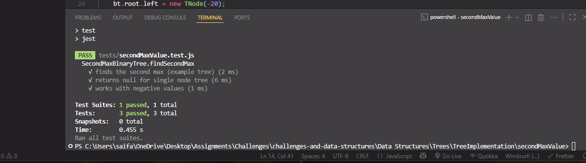

# 🌳 Find Second Maximum Value in a Binary Tree

> An implementation to find the **second maximum value** in a binary tree in JavaScript using recursion and a `TNode` class. Includes Jest tests.

[⬅ Back to Root README](../../../../README.md)

---

## 🧩 Problem Domain

Extend the binary tree implementation to find the second largest value in a tree.

### **SecondMaxBinaryTree**

A class that extends **BinaryTree** and adds:

- `findSecondMax()` – finds the second largest value in the tree.

All methods handle errors gracefully with `try...catch`.

---

## 🔢 Inputs and Expected Outputs (Examples)

For this tree:

```text
        10
       /  \
      5    20
     / \   / \
    3   7 15 25
```

| Function        | Expected Output |
| --------------- | --------------- |
| findSecondMax() | 20              |

---

## ⚠️ Edge Cases

- Empty tree → returns `null`
- Single node tree → returns `null`
- Duplicate maximum values → return the first found node less than max

---

## 👀 Visual Representation

```text
Initial Tree:
       10
      /  \
     5    20
    / \   / \
   3   7 15 25

Second Max: 20
```

---

## ⚙️ Algorithm Overview

- Traverse the tree recursively.
- Track **maximum** and **second maximum** values.
- Update values based on current node.
- Return second maximum after traversal.

---

## 💻 Files

> Full implementation for this challenge lives in this folder:  
> [`src/TNode.js`](../src/TNode.js) · [`src/secondMaxValue.js`](./src/secondMaxValue.js) · [`src/app.js`](./src/app.js)  
> Tests: [`tests/secondMaxValue.test.js`](./tests/secondMaxValue.test.js)

---

## 🧮 Big‑O Summary

| Operation       | Time (avg) | Time (worst) | Space |
| --------------- | ---------- | ------------ | ----- |
| findSecondMax() | O(n)       | O(n)         | O(n)  |

---

## ▶️ How to Run

### 1) Navigate to this folder

```bash
cd "Data Structures/Trees/TreeImplementation/SecondMaxValue"
```

### 2) Run the demo

```bash
node src/app.js
```

🖥️ Example Output:


### 3) Run tests (Jest)

```bash
npm install
npm test
```

Or run just this test file:

```bash
npm test secondMaxValue.test.js
```

✅ Test Results:
All tests pass successfully.

🖥️ Example Output:

