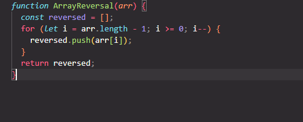
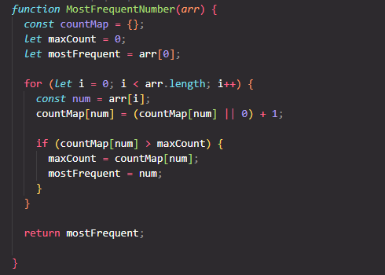
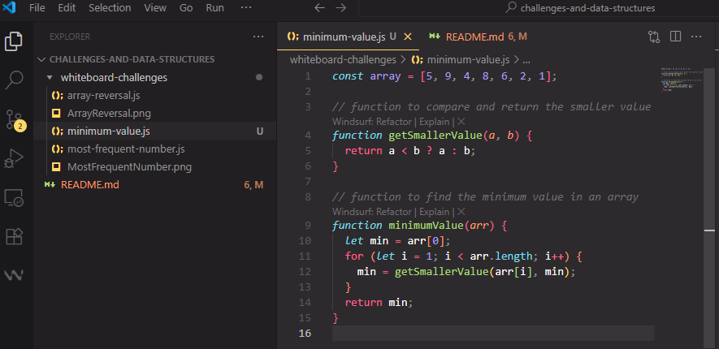
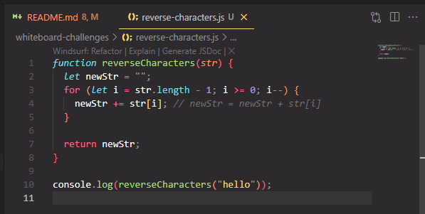
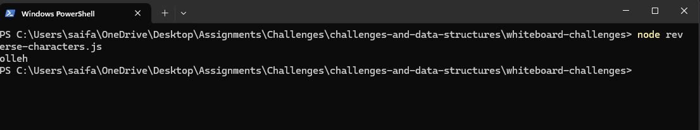

# Whiteboard Challenges

## Challenge 01:

### Challenge (A) Array Reversal :

**Description:**  
Write a function named `ArrayReversal` that takes an array and returns a new array in reverse order without using built-in methods.

**Whiteboard Image:**  

---

### Challenge (B) Most Frequent Number :

**Description:**  
Write a function that returns the most frequent number in an array. If tied, return the first one.

**Whiteboard Image:**  

---

## Challenge 02:

### Challenge_Minimum Value :

**Description:**  
Write a function called MinimumValue that accepts an array of integers. Without using built-in methods, the function should return the smallest value in the array.

### According to the best preactise recommendation, i devide my code into multi functions.

**Whiteboard Image:**  

---

## Challenge 03:

### Challenge_Reverse Characters :

**Description:**  
Write a function called ReverseCharacters that takes a single string as input. Without using built-in methods, the function should return the string with all characters reversed .

**Whiteboard Image:**

### The log value in the Terminal :

