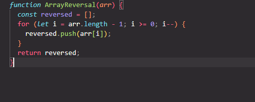
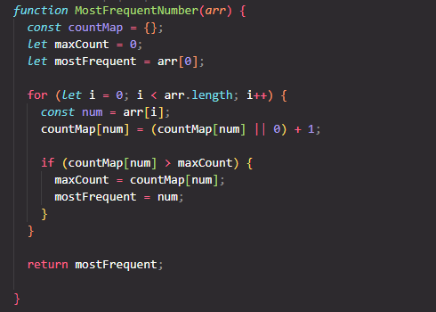
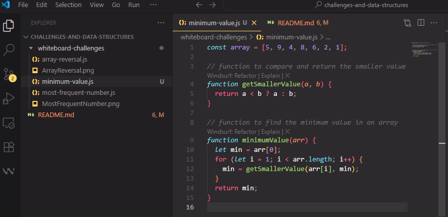
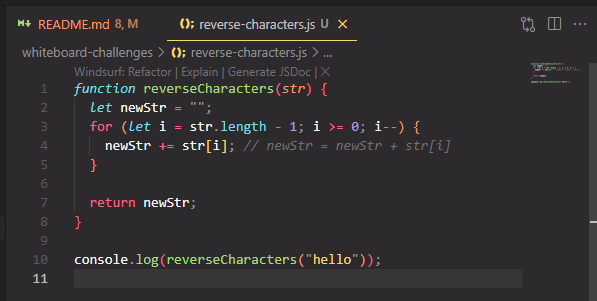
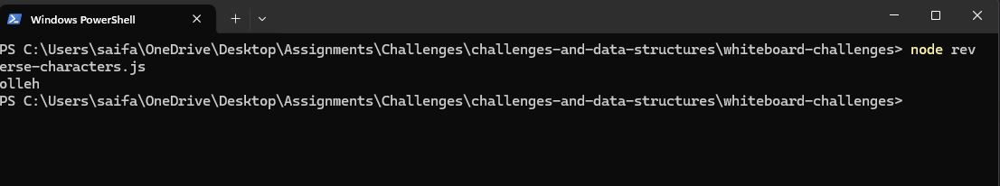
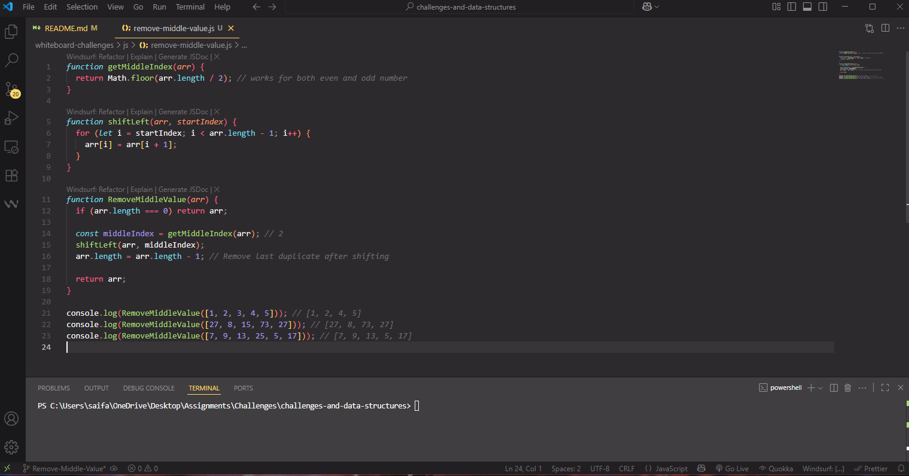
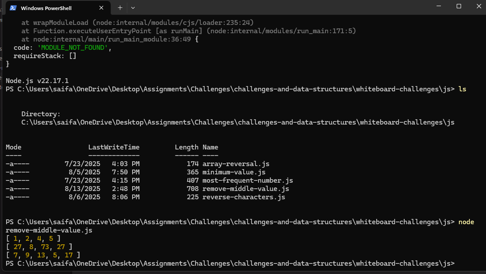

# Whiteboard Challenges

## Challenge 01:

### Challenge (A) Array Reversal :

**Description:**  
Write a function named `ArrayReversal` that takes an array and returns a new array in reverse order without using built-in methods.

**Whiteboard Image:**  

---

### Challenge (B) Most Frequent Number :

**Description:**  
Write a function that returns the most frequent number in an array. If tied, return the first one.

**Whiteboard Image:**  

---

## Challenge 02:

### Challenge_Minimum Value :

**Description:**  
Write a function called MinimumValue that accepts an array of integers. Without using built-in methods, the function should return the smallest value in the array.

### According to the best preactise recommendation, i devide my code into multi functions.

**Whiteboard Image:**  

---

## Challenge 03:

### Challenge_Reverse Characters :

**Description:**  
Write a function called ReverseCharacters that takes a single string as input. Without using built-in methods, the function should return the string with all characters reversed .

**Whiteboard Image:**

### The console output the Terminal :

## 

## Challenge 04:

### Challenge_Remove-Middle-Value :

**Description:**  
Write a function called RemoveMiddleValue that takes an array as its parameter. Without utilizing any of the built-in methods available in the language, the function should remove tha value at the middle index of the array. The function shuold return the modified array.

**Whiteboard Image:**

### The console output in the Terminal :

---

## Additional Resources

- [Go to LinkedList README](./Data%20Structures/LinkedList/Linked-List-Implementation/README.md)

- [Go to Reversed LinkedList README](./Data%20Structures/LinkedList/Linked-List-Implementation/Reverse/README.md)

- [Go to MergeSorted LinkedList README](./Data%20Structures/LinkedList/Linked-List-Implementation/MergeSorted/README.md)

- [Go to Rotate LinkedList README](./Data%20Structures/LinkedList/Linked-List-Implementation/RotateLinkedList/README.md)

- [Go to Stack & Queue data strucutre README](./Data%20Structures/Stack-Queue/Stack-Queue-Implementation/README.md)

- [Go to Min Stack data strucutre README](./Data%20Structures/Stack-Queue/MinStack/README.md)

- [Go to Delete Middle Element Stack data strucutre README](./Data%20Structures/Stack-Queue/DeleteMiddleElement/README.md)

- [Go to Tree Implementation data strucutre README](./Data%20Structures/Trees/TreeImplementation/README.md)

- [Go to Tree Find SecondMaxValue data strucutre README](./Data%20Structures/Trees/TreeImplementation/secondMaxValue/README.md)
